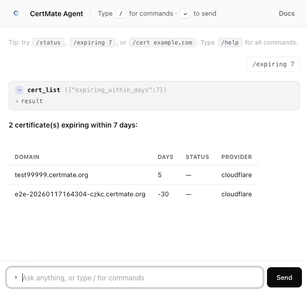

# certmate-agent



Documentation assistant for [CertMate](https://www.certmate.org)
([source](https://github.com/fabriziosalmi/certmate)).

Embedded local LLM (LM Studio by default) + retrieval over CertMate's
documentation. Ask how a feature works, how to configure a DNS provider, what
DNS-01 or a deploy hook actually does — answers are grounded in the docs and
cite the file they came from.

**It does not connect to a running CertMate instance and holds no
credentials.** For driving a live instance from an assistant, CertMate ships
its own MCP server (`mcp/` in the CertMate repository), maintained where the
API is maintained. This agent used to map that API too; a second mapping could
only drift out of date, and it had — so it was removed in 0.2.0 along with the
credential it needed to be useful.

## Ecosystem

Part of the [CertMate](https://github.com/fabriziosalmi/certmate) ecosystem:

- **[CertMate](https://github.com/fabriziosalmi/certmate)** — open-source SSL certificate management (API + UI).
- **[certmate-tools](https://github.com/fabriziosalmi/certmate-tools)** — free, privacy-first, client-side TLS / certificate / ACME diagnostics.
- **[nis2-public](https://github.com/fabriziosalmi/nis2-public)** — NIS2 continuous posture management & remediation.

**Enterprise / high-scale** — multi-tenant, mTLS, white-label and NIS2-aligned deployments are available through *CertMate-ng* (source-available, BSL 1.1, EU-built). Contact **fabrizio.salmi@gmail.com**.

## Architecture

```
 user ──► widget (vanilla web component)
            │ SSE
            ▼
       FastAPI agent ──► LM Studio (chat + embeddings, OpenAI-compatible)
            │
            └─► local docs index (gzipped JSON, no network at query time)
```

- Single LLM endpoint, configurable via env (LM Studio by default).
- One tool, `docs_search`, executed inline against the local index.
- No CertMate connection and no credential: the agent cannot read or change
  anything on an instance, which is the point.
- sqlite for conversations + audit log.

## Run

```bash
cp .env.example .env
# set CERTMATE_URL + CERTMATE_TOKEN, point LMSTUDIO_URL at your LM Studio server

uv pip install -e .          # or: pip install -e .
python -m agent.main
```

Open `http://127.0.0.1:8765/widget/` for the standalone test page.

Embed in CertMate or any page:

```html
<script type="module" src="http://127.0.0.1:8765/widget/certmate-agent.js"></script>
<link rel="stylesheet" href="http://127.0.0.1:8765/widget/certmate-agent.css">
<certmate-agent endpoint="http://127.0.0.1:8765"></certmate-agent>
```

## Endpoints

| Method | Path | What |
|---|---|---|
| GET | `/health` | agent + LM Studio health |
| GET | `/models` | check the configured chat/embed models are loaded |
| POST | `/chat` | SSE stream — body `{message, history?}` |

## Model notes

Configured by default with `google/gemma-4-e2b` (chat) and
`text-embedding-embeddinggemma-300m` (embeddings).

Gemma's small variants are "thinking" models — they spend tokens on internal reasoning before
producing output. If you see empty assistant replies, raise `AGENT_MAX_TOKENS` (try 2048+), or
swap to an instruct model with reliable native tool-calling such as `qwen/qwen3-8b`.

## Tool surface

One tool: `docs_search`, retrieval over the CertMate documentation, executed
locally against the index. There is no write path, so there is no confirmation
flow.

## Slash commands (deterministic — skip the LLM)

| Command | What |
|---|---|
| `/help` (`/?`) | List all commands |
| `/docs <query>` (`/ask`) | Search the CertMate docs (RAG) |
| `/reindex [repo] [branch]` | Rebuild the docs index (admin only) |

Slash commands bypass the LLM entirely — sub-200ms response, deterministic
output.

## Docs RAG (built once, queried locally)

The agent ships with an indexer that pulls `README.md` and `docs/*.md` from
the CertMate GitHub repo, chunks by markdown headings, and embeds with the
local `text-embedding-embeddinggemma-300m`. Queries embed with the same
model and cosine-rank in pure Python (no numpy / vector DB).

```bash
python -m agent.rag.indexer                  # defaults: fabriziosalmi/certmate@main
python -m agent.rag.indexer --repo X/Y --branch main
python -m agent.rag.indexer --paths README.md,docs/api.md
```

Index is written to `docs_index/index.json.gz` (~2 MB for 271 chunks). The
agent loads it lazily at first `docs_search` call — restart not required
after rebuild.

Both `/docs <query>` (slash, sub-50ms after embed) and the LLM tool
`docs_search` use the same path. The system prompt instructs the LLM to
call `docs_search` for any conceptual / how-to question, which keeps
small models like `gemma-4-e2b` grounded.

## Admin gate

Set `AGENT_ADMIN_TOKEN=<secret>` to enable admin-only commands like
`/reindex`. Clients prove admin status by sending one of:

- HTTP header: `X-Agent-Admin: <secret>` (preferred)
- JSON body field: `"admin_token": "<secret>"`

When empty, all admin commands are disabled (404-equivalent: refused with
an explanatory error in the chat). Comparison is constant-time.

In the widget, set the attribute only on admin-facing pages:

```html
<certmate-agent endpoint="…" admin-token="MY_SECRET"></certmate-agent>
```

## Conversation persistence

Optional. Off by default (stateless: client passes history each turn).
Set `AGENT_PERSIST_CONVERSATIONS=true` to:

- mount `/conversations/<session_id>` (GET to fetch, DELETE to clear)
- store user + assistant messages in sqlite, keyed by `session_id`
- on each turn the server loads history server-side and ignores the
  client's `history` field — survives page reloads, multi-tab use, and
  works when the agent is behind a load balancer

In the widget, opt in with the `persist` attribute (generates a per-host
`session_id` in localStorage and adds a "New session" button):

```html
<certmate-agent endpoint="…" persist></certmate-agent>
```

## Background scheduler

A single asyncio task runs every `AGENT_CLEANUP_INTERVAL_SECONDS`
(default 1 hour) and prunes:

- `conversation_messages` older than `AGENT_CONVERSATION_TTL_DAYS`
  (only when `AGENT_PERSIST_CONVERSATIONS=true`)

Set `AGENT_CLEANUP_INTERVAL_SECONDS=0` to disable. A pass runs on boot
so a long-stopped instance cleans backlog before serving traffic.

## Optional fallback LLM

Set `OPENROUTER_API_KEY` to enable a fallback chat provider. The agent
tries the primary LM Studio first and falls back to OpenRouter only when
the primary errors out (connection, timeout, 5xx). A small circuit
breaker trips the primary after `LLM_PRIMARY_FAILURE_THRESHOLD`
consecutive failures and keeps it tripped for
`LLM_PRIMARY_COOLDOWN_SECONDS` before retrying.

Embeddings always stay on the primary (only LM Studio runs the embedding
model). The widget receives an extra `status` event "served via
openrouter" when the fallback handled the turn, so you can see it in the
chat log.

## Public deployment (Fly.io + weekly index)

Pre-built workflows + manifest ship the public docs assistant
(`agent.certmate.org`-style) end-to-end:

### 1. Weekly index rebuild — `.github/workflows/rebuild-docs-index.yml`

Runs every Monday 06:00 UTC and on manual trigger. Pulls
`fabriziosalmi/certmate@main`, chunks + embeds the docs, publishes the
resulting index (gzipped JSON, never a pickle — see below) as an
`index-latest` GitHub Release.

Required repo secrets (`Settings → Secrets and variables → Actions`):

| Secret | Example value |
|---|---|
| `INDEX_EMBED_URL` | `https://api.cloudflare.com/client/v4/accounts/<ACCOUNT_ID>/ai/v1` |
| `INDEX_EMBED_API_KEY` | Cloudflare API token (Workers AI scope) |
| `INDEX_EMBED_MODEL` | `@cf/baai/bge-base-en-v1.5` (768-dim) |

OpenAI works too:

| Secret | Example value |
|---|---|
| `INDEX_EMBED_URL` | `https://api.openai.com/v1` |
| `INDEX_EMBED_API_KEY` | `sk-...` |
| `INDEX_EMBED_MODEL` | `text-embedding-3-small` |

**Important**: the same embedding model must be configured on the runtime
that serves the index. The store warns loudly if they don't match.

### 2. Fly.io deploy — `fly.toml` + `.github/workflows/deploy-fly.yml`

The Fly app fetches the published index on cold start via
`AGENT_INDEX_BOOTSTRAP_URL` and uses Cloudflare Workers AI (or OpenRouter)
for chat. Set `AGENT_INDEX_BOOTSTRAP_SHA256` to the digest of the artifact
you intend to serve: without it, whoever can publish to that release decides
what the agent says about CertMate. Setup once:

```bash
fly apps create certmate-agent              # pick any name
# Edit fly.toml: replace REPLACE_ME in LMSTUDIO_URL with your CF account id
fly secrets set LMSTUDIO_API_KEY=<token>    # CF Workers AI token
fly volumes create certmate_agent_data --size 1 --region fra
fly deploy                                   # one-shot bootstrap
```

Get a deploy token for GitHub:

```bash
fly tokens create deploy -x 99999h
# paste into repo secret FLY_API_TOKEN
```

After that, the deploy workflow runs automatically on:

- push to `main` (rebuilds the image)
- successful `rebuild-docs-index` (just restarts machines so they re-bootstrap the index, no image rebuild)
- manual dispatch

Point your DNS:

```
agent.certmate.org → CNAME → <app-name>.fly.dev
```

Fly handles TLS issuance + renewal — fitting for the CertMate ecosystem.

### Why this split scales

| Layer | Updates when | Cost |
|---|---|---|
| Docker image | code/config changes (rare) | 0 |
| Index artifact | weekly cron or doc push | $0.001/run on OpenAI; free on CF WAI |
| Fly machine | code change or index refresh | scale-to-zero, ~free under low traffic |

## Docker

`docker/Dockerfile` + `docker/docker-compose.example.yml` provided.
sqlite db + RAG index live under `/data` (volume). Build the index from
inside the container the first time:

```bash
docker compose -f docker/docker-compose.example.yml up -d
docker compose -f docker/docker-compose.example.yml exec certmate-agent \
    python -m agent.rag.indexer
```

After that you can rebuild via the `/reindex` admin command from the widget
(no shell access needed) — hot-swap, no restart.
